# Universidad Técnica de Ambato  
## Facultad de Ingenieria en Sistemas, Electrónica e Industrial
### Carrera de Software  

**Asignatura:** Manejo y Configuración de Software  
**Nombre del Estudiante:** Cusme Vélez Manuel Steven  
**Fecha:** 08/04/2027

---

# Evaluación Práctica de Git y GitHub

## Instrucciones Generales

- Cada pregunta debe ser respondida directamente en este archivo **(README.md)** debajo del enunciado correspondiente. 
- Es importante que se coloque capturas de pantalla como evidencia de la parte práctica. Se recomienda crear una carpeta `images/` para almacenar las capturas de pantalla.
- Cada respuesta debe ir acompañada de uno o más **commits**, según se indique en cada pregunta.
- Cuando se indique, deberán realizarse acciones prácticas dentro del repositorio (como creación de archivos, ramas, resolución de conflictos, etc.).
- Cada pregunta debe estar **etiquetada con un tag**, únicamente en el commit final correspondiente, con el formato: `"Pregunta 1"`, `"Pregunta 2"`, etc.

---

## Pregunta 1 (1 punto)

**Explicar la diferencia entre los siguientes conceptos/comandos en Git y GitHub:**

- `git clone`  
- `fork`  
- `git pull`

### Parte práctica:

- Realizar un **fork** de este repositorio en la cuenta personal de GitHub del estudiante.
- Luego, realizar un **clone** del fork en el equipo local.
- En este README, describir el proceso seguido:
  - ¿Cómo se realizó el fork?
  - ¿Cómo se realizó el clone del fork?
  - ¿Cómo se verificó que se estaba trabajando sobre el fork y no sobre el repositorio original?
- Realizar en la rama `main` todo lo que corresponde a esta pregunta.

**📝 Respuesta:**

-fork: Es una copia de una repositorio ajeno a tu cuenta de Github desde la web, esto no afecta la original
-git clone: descarga un repositorio remoto a tu PC con todo el historial
-git pull: descarga y fusiona cambios del remoto a tu copia local para actualizarte

## Proceso seguido
¿Cómo se realizó el fork?
Se accedió al repositorio original del profesor en GitHub y se
hizo clic en el botón Fork, seleccionando la cuenta ManuelCusme.

¿Cómo se realizó el clone del fork?
Se ejecutó: git clone https://github.com/ManuelCusme/EVALUACION_1P.git .Esto descargó el repositorio a la máquina local.

¿Cómo se verificó que se trabajaba sobre el fork?
Se ejecutó git remote -v, que mostró la URL apuntando a la cuenta ManuelCusme y no al repositorio del profesor, confirmando que se trabaja sobre el fork.

## Evidencia
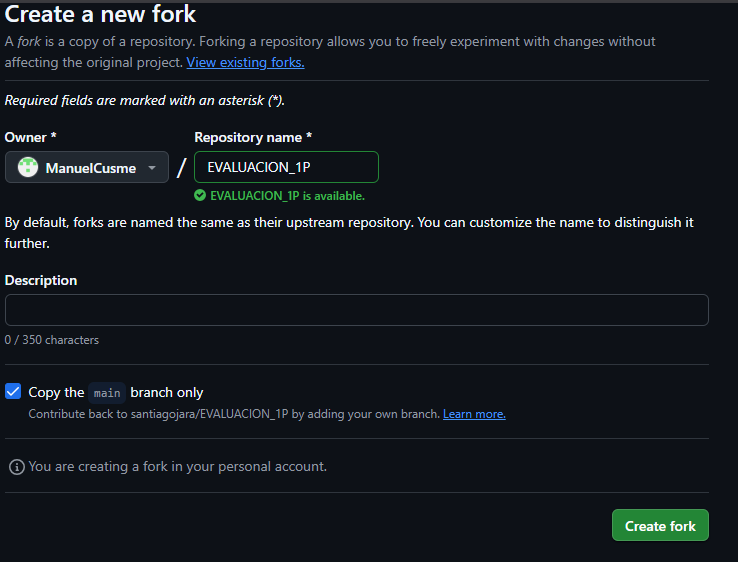
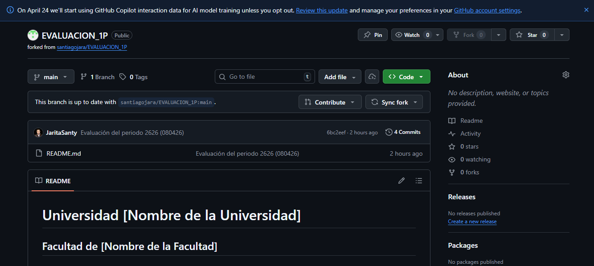
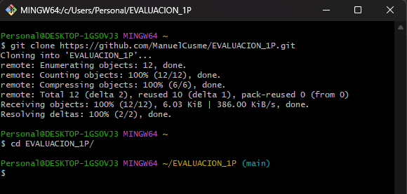
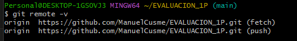
---

## Pregunta 2 (1 punto)

**Configurar un archivo `.gitignore` para que ignore:**

- Todos los archivos con extensión `.log`.
- Una carpeta llamada `temp/`.
- Todos los archivos `.md` y `.txt`de la carpeta `doc/`. (Probar agregando un archivo `prueba.md` y un archivo `prueba.txt` dentro de la carpeta y fuera de la carpeta.)

### Requisitos:

1. Realizar un **primer commit** que incluya únicamente el archivo `.gitignore` con las reglas de exclusión definidas.
2. Realizar un **segundo commit** que incluya las creación de los archivos de prueba.
2. Realizar un **tercer commit** donde se explique en este README la función del archivo `.gitignore` y se muestre evidencia de que los archivos y carpetas indicadas no están siendo rastreadas por Git.

**Importante:**  
- Solo el **tercer commit** debe llevar el **tag `"Pregunta 2"`**.

**📝 Respuesta:**

## ¿Qué es el archivo .gitignore?
El archivo .gitignore le indica a Git qué archivos o carpetas debe ignorar y no rastrear. Es útil para excluir archivos temporales, logs, configuraciones locales o cualquier archivo que no deba subirse al repositorio.

## Reglas configuradas
- *.log → ignora todos los archivos con extensión .log
- temp/ → ignora toda la carpeta temp/ y su contenido
- doc/*.md → ignora archivos .md dentro de la carpeta doc/
- doc/*.txt → ignora archivos .txt dentro de la carpeta doc/

## Evidencia
Los archivos dentro de doc/ y la carpeta temp/ no aparecen
en git status, confirmando que están siendo ignorados.
Los archivos prueba.md y prueba.txt en la raíz SÍ aparecen
porque no están dentro de doc/.

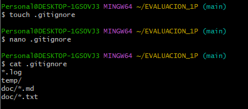
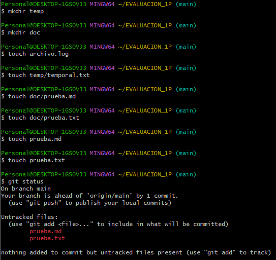

---

## Pregunta 3 (2 puntos)

**Utilizar Git Flow para desarrollar una nueva funcionalidad llamada `ingresar-encabezado`.**

### Requisitos:

- Inicializar el repositorio con Git Flow, utilizando las ramas por defecto: `main` y `develop`.
- Crear una rama de tipo `feature` con el nombre `ingresar-encabezado`.
- En dicha rama, **completar con los datos personales del estudiante** el encabezado que ya se encuentra al inicio de este archivo `README.md`.
- Realizar al menos un commit durante el desarrollo.
- Finalizar el hotfix siguiendo el flujo de trabajo establecido por Git Flow.

### En la sección de respuesta, se debe incluir:

- Los **comandos exactos** utilizados desde la inicialización de Git Flow hasta el cierre de la rama.
- Una descripción del **proceso seguido**, indicando el propósito de cada paso.
- Una reflexión sobre las **ventajas de aplicar Git Flow**, especialmente en contextos colaborativos o proyectos de larga duración.

**Importante:**

- Deben realizarse varios commits durante esta pregunta.
- **Solo el commit final** debe llevar el **tag `"Pregunta 3"`**.
- El flujo debe respetar la estructura de Git Flow con las ramas `develop` y `main`.

**📝 Respuesta:**

## Comandos utilizados

1. git flow init
   Inicializa Git Flow. Configura las ramas principales main y
   develop, y los prefijos para features, releases y hotfixes.

2. git flow feature start ingresar-encabezado
   Crea la rama feature/ingresar-encabezado desde develop
   y se posiciona en ella automáticamente.

3. git add / git commit
   Registra los cambios realizados dentro de la rama feature.

4. git flow feature finish ingresar-encabezado
   Fusiona feature/ingresar-encabezado hacia develop,
   elimina la rama feature y regresa a develop.

## Descripción del proceso
Se inicializó Git Flow con main como rama de producción y
develop como rama de desarrollo. Se creó la feature
ingresar-encabezado donde se completaron los datos del
encabezado del README. Al finalizar, Git Flow realizó el
merge automático hacia develop y eliminó la rama feature.

## Ventajas de Git Flow
- Separa desarrollo (develop) de producción (main)
- Permite trabajar en funcionalidades sin afectar código estable
- Facilita el trabajo colaborativo con ramas bien definidas
- El historial queda ordenado por funcionalidades
- Ideal para proyectos con versiones y releases planificados

## Evidencia
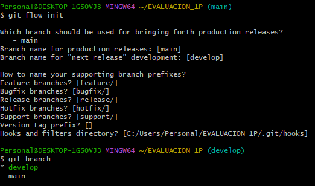
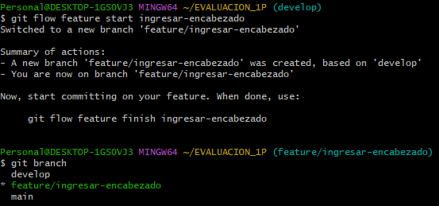
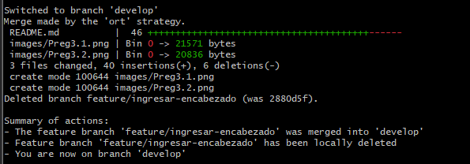

---

## Pregunta 4 (2 puntos)

**Trabajo con Issues y Pull Requests**

### Parte teórica:

- ¿Qué es un Pull Request y cuál es su función dentro de un flujo de trabajo colaborativo con Git y GitHub?
- ¿Por qué es importante revisar un Pull Request antes de fusionarlo con la rama principal?
- ¿Qué tipo de observaciones o validaciones se suelen realizar durante la revisión de un Pull Request?

### Parte práctica:

- Trabajar en la rama `develop`, ya existente desde la configuración de Git Flow.
- Realizar los cambios necesarios en este archivo `README.md` para responder las preguntas.
- Realizar un **commit** con los cambios de la primera pregunta y subirlo a la rama `develop` del repositorio remoto.
- Crear un **pull request** desde `develop` hacia `main` en GitHub, con el nombre `"Pregunta 4 - Apellido Nombre"`.
- Crear comentarios solicitando: 1. que se agregue la respuesta de la segunda pregunta y luego agregando la respuesta con el respectivo commit; y 2. el mismo procedimiento para la tercera pregunta.
- **Aprobar** el pull request para que se haga el merge respectivo hacia `main`.

### En la sección de respuesta, se debe incluir:

- Un resumen del procedimiento realizado con las respectivas preguntas y capturas.
- El número y enlace al pull request.

**📝 Respuesta:**

## 1. ¿Qué es un Pull Request y cuál es su función?
Un Pull Request (PR) es una solicitud para fusionar los cambios
de una rama hacia otra dentro de un repositorio en GitHub.
Su función principal es permitir que otros miembros del equipo
revisen el código antes de integrarlo a la rama principal.
Es una herramienta clave en flujos de trabajo colaborativos
porque centraliza la discusión sobre los cambios propuestos.

## 2. ¿Por qué es importante revisar un PR antes de fusionarlo?
Revisar un PR antes de fusionarlo es importante porque permite
detectar errores, bugs o problemas de seguridad antes de que
lleguen a la rama principal. También asegura que el código
cumpla con los estándares del proyecto y facilita el aprendizaje
entre miembros del equipo al compartir conocimiento mediante
los comentarios de revisión.

## 3. ¿Qué observaciones se realizan durante la revisión de un PR?
Durante la revisión de un PR se suelen verificar:
- Que el código funcione correctamente y no rompa funcionalidades existentes
- Que siga las convenciones de estilo del proyecto
- Que no existan vulnerabilidades de seguridad
- Que los mensajes de commit sean claros y descriptivos
- Que se incluyan pruebas si corresponde
- Que la documentación esté actualizada

## Resumen del procedimiento
Se trabajó en la rama develop respondiendo cada pregunta con
su respectivo commit y push. Se creó el PR desde develop hacia
main con el título "Pregunta 4 - Cusme Manuel". Se simuló el
proceso de revisión agregando comentarios solicitando cada
respuesta y luego completándolas con commits adicionales.

## Número y enlace al Pull Request
PR #1 - https://github.com/ManuelCusme/EVALUACION_1P/pull/1

## Evidencia
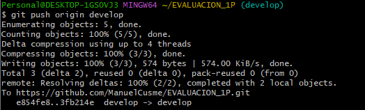
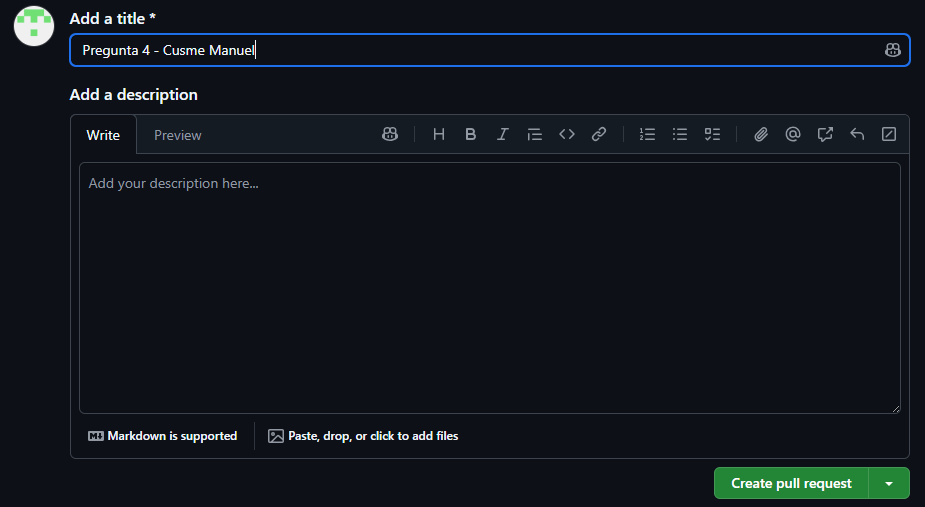
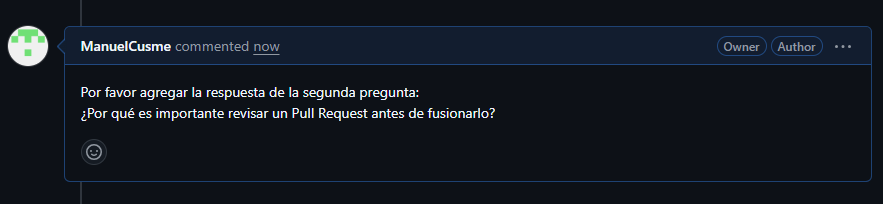
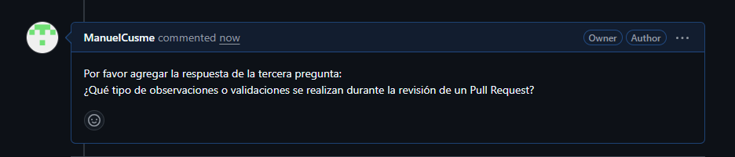

---

## Pregunta 5 (2 puntos)

**Resolver conflictos entre ramas y realizar un Pull Request**

### Requisitos:

- Crear dos ramas llamadas `ramaA` y `ramaB`, ambas a partir de la rama `develop`.
- En `ramaA`, crear un archivo llamado `archivoA.txt` con el contenido:  
  `Contenido A`
- En `ramaB`, crear un archivo con el mismo nombre (`archivoA.txt`), pero con el contenido:  
  `Contenido B`
- Intentar fusionar `ramaB` sobre `ramaA`, lo cual debe generar un conflicto.
- Resolver el conflicto combinando ambos contenidos.
- Realizar el merge de `ramaA` hacia `develop`.
- Crear un **pull request** desde `develop` hacia `main`.
- Una vez completado lo anterior, eliminar las ramas `ramaA` y `ramaB`.

### En la sección de respuesta, se debe incluir:

- El procedimiento completo:
  - Cómo se crearon las ramas.
  - Cómo se generó y resolvió el conflicto.
  - Cómo se realizó el merge hacia `develop`.
  - Cómo se eliminaron las ramas al finalizar.
- El enlace al pull request.
- Una breve explicación de qué es un conflicto en Git y por qué ocurrió en este caso.

**📝 Respuesta:**

<!-- Escribe aquí tu respuesta completa a la Pregunta 5 -->

---

## Pregunta 6 (2 puntos)

**Realizar limpieza, explicar versionamiento semántico y enviar cambios al repositorio original**

### Requisitos:

- Trabajar en la rama `develop` del fork del repositorio.
- Eliminar los archivos `archivoA.txt` y `archivoB.txt` creados en preguntas anteriores.
- Realizar un merge desde `develop` hacia `main` en el repositorio local.
- Enviar los cambios de la rama `main` local a la rama `develop` del repositorio remoto (fork). Recuerde incluir todos los tags creados (6 tags).
- Finalmente, crear un **pull request** desde la rama `develop` del fork hacia la rama `main` del repositorio original (del cual se realizó el fork en la Pregunta 1). El titulo del pull request debe ser `"NOMBRE APELLIDOS"`, en la descripción colocar el link de su repositorio de GitHub.

### En la sección de respuesta, se debe incluir:

- Una explicación del proceso realizado paso a paso.
- Una explicación del **versionamiento semántico**, indicando:
  - En qué consiste.
  - Sus tres componentes (MAJOR, MINOR, PATCH).
- Si hace falta agregar alguna evidencia adicional, agregue un tag adicional que sea `Version Final`.

**📝 Respuesta:**

<!-- Escribe aquí tu respuesta completa a la Pregunta 6 -->
